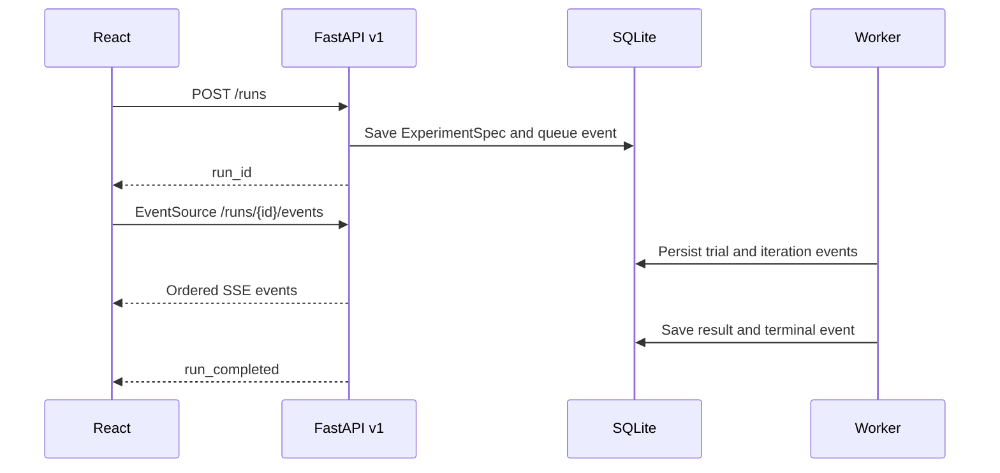

# Events and Lifecycle

`GET /api/v1/runs/{run_id}/events` emits named Server-Sent Events. Each data
payload contains `sequence_number`, `type`, `timestamp`, and `payload`.

| Event | Meaning |
| --- | --- |
| `validation_passed` | The frozen specification is valid. |
| `run_queued` | A managed run is waiting for a worker. |
| `worker_started` | A local subprocess began. |
| `dataset_prepared` | Splitting and preprocessing completed. |
| `run_started` | Optimization started and announced its fit budget. |
| `trial_started` | A candidate began fitting. |
| `training_epoch` | A supported neural model reported epoch progress. |
| `trial_completed` / `trial_failed` | A candidate ended. |
| `iteration_completed` | A complete PSO iteration ended. |
| `best_updated` | A candidate improved the optimization cost. |
| `run_completed` / `run_failed` / `run_cancelled` | Terminal state. |

On disconnection, the frontend polls the run status and reloads `/history`.
Sequence numbers prevent duplicate events during recovery.
