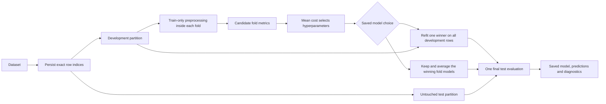

# Evaluation and reproducibility

The dashboard defaults to five-fold cross-validation and a 20% untouched test
partition. Regression uses shuffled K-fold; classification preserves class
proportions when stratification is enabled. Each candidate's mean fold metric
determines its optimization cost. Results retain the individual folds and their
population standard deviation.



Imputation, encoding and scaling belong inside each estimator pipeline. They
are fitted separately using each fold's training rows. Validation and test
rows never fit those fold preprocessors. After selection, the winning pipeline
is fitted on all development rows and evaluated on the untouched test partition.

The `evaluation` section controls `protocol`, `folds`, `shuffle`, `stratify`,
`test_size`, `random_state`, `positive_label`, `decision_threshold` and
`refit_best`. The compatible `split` section also supports stratification, test
share and seed. Explicit evaluation values take precedence; persisted specs
contain matching values in both sections. An unspecified seed is generated once
and saved. Dashboard split controls are the source for both sections.

Single-holdout evaluation remains available. It selects candidates on a separate
validation partition and, by default, refits the winner on training plus
validation rows. A separately saved selection model produces validation
predictions; the final model produces test predictions. Turning off final refit
keeps the holdout selection model. For cross-validation, turning it off saves the
winning candidate's fitted fold models as an ensemble. Its predictions average
those models, so it remains usable without an additional training fit.

| Saved-model choice | Additional fits | Predictor saved after cross-validation | Predictor saved after holdout | What its final score means |
| --- | ---: | --- | --- | --- |
| **Refit one winner** | 1 | One new model trained on all development rows | One new model trained on training plus validation rows | The test score belongs to the new fit and can differ from the candidate's CV or validation score. |
| **Keep evaluated model(s)** | 0 | The winning candidate's fitted fold models, saved as an averaging ensemble | The winning model already fitted on the training partition | No new model is initialized; the CV ensemble is a different predictor from a single refitted model, while the holdout model has not seen validation rows. |

The search result and the saved predictor serve different purposes. Candidate
selection always uses the best aggregate cost seen anywhere in the search; the
last candidate does not become the winner when it scores worse. A refitted neural
network can also produce a different test score because it is trained again on a
different amount of data. The PyTorch recipe records its seed and restores the
weights from its best monitored epoch. The no-refit fold ensemble avoids that
additional initialization.

## Chronological evaluation

Set `split.method` to `chronological` for a single ordered series. An optional
`split.time_column` sorts numeric or date/time values from earliest to latest;
that column is excluded from predictors. Timestamps must be present and unique.
Without a time column, source row order is used. Original row identifiers remain
in saved partition indices.

For a holdout, the earliest rows train, the next block validates, and the latest
block tests. `split.gap` excludes a chosen number of rows before validation and
test. Validation and test shares refer to the full dataset; gaps reduce the
initial training share. Final refitting includes the development rows, including
the former gap before validation, but still excludes the gap before test.

Chronological CV uses expanding training windows with the configured fold count
and gap, followed by the reserved final test block. It never shuffles or
stratifies. See the [scikit-learn TimeSeriesSplit contract](https://scikit-learn.org/stable/modules/generated/sklearn.model_selection.TimeSeriesSplit.html).
Comparable fold durations assume evenly spaced observations. This workflow
evaluates a supplied tabular forecasting target; prepare horizon-aligned targets
and past-only lag features before importing the dataset.

```json
{
  "split": {"method": "chronological", "time_column": "date", "gap": 2,
            "validation_size": 0.2, "test_size": 0.2},
  "evaluation": {"protocol": "holdout", "refit_best": true}
}
```

Binary classification can explicitly choose the positive class. AUC, PR AUC,
sensitivity, specificity and thresholded predictions use that selection. When
unset, the last ordered target class is positive. The default probability
threshold is 0.5; changing it does not change probability ranking metrics.

Every managed run saves the exact dataset, partition indices, fold assignments,
specification, environment, seeds and dataset fingerprint. Results and downloads
load those saved inputs and models without retraining. Fold indices are positions
within the persisted development partition, whose entries identify original rows.
CV summaries are aggregates; select the untouched test partition for individual
saved-model or fold-ensemble predictions. Runs created before fold ensembles were
introduced may contain their metrics and winning parameters without a model; the
Results page can prepare their saved specification for a new run.

Tournament submissions freeze the dataset, target, task, preprocessing, metric,
evaluation, seed, strategy and budget across all selected models. Model recipes
and their search spaces may differ. A shared budget is an upper bound: a finite
grid or early stopping may use fewer candidates. Test performance should be
reported after selection; repeatedly choosing models using test scores weakens
the test partition's independence.
