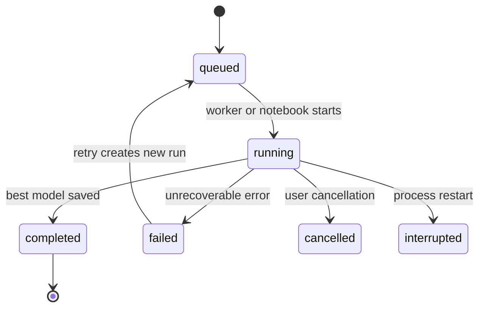

# Experiments, Runs, and Trials

PSPSO records work at three levels:

| Level | Meaning |
| --- | --- |
| Experiment | A named collection used to compare related runs. |
| Run | One frozen dataset, model, search, evaluation, and runtime specification. |
| Trial | One fitted candidate parameter set inside a run. |

A retry creates a new linked run. It never overwrites the failed or cancelled
run, so the original event trail remains available.

Dashboard, CLI, and tracked notebook runs use the same SQLite repository. An
untracked notebook call returns an `OptimizationResult` without writing to disk.

## Run Lifecycle

Every transition and trial event receives a monotonically increasing sequence
number. The live dashboard and historical replay therefore render the same
timeline.
