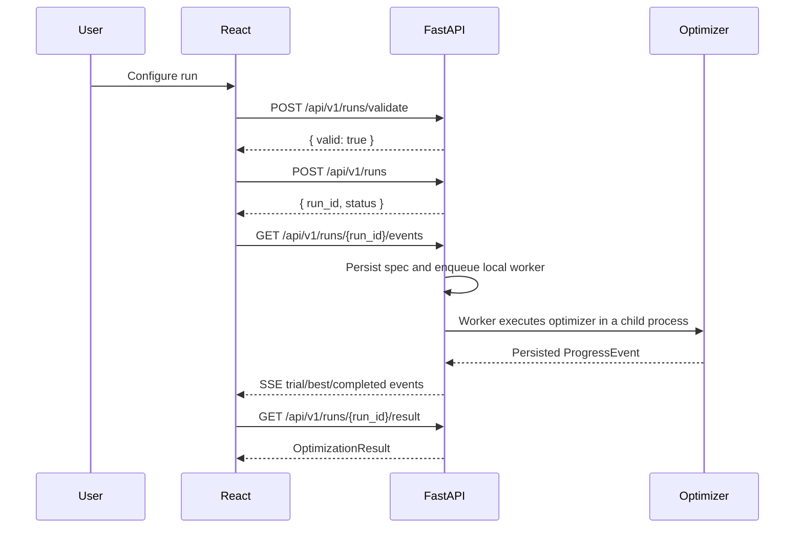
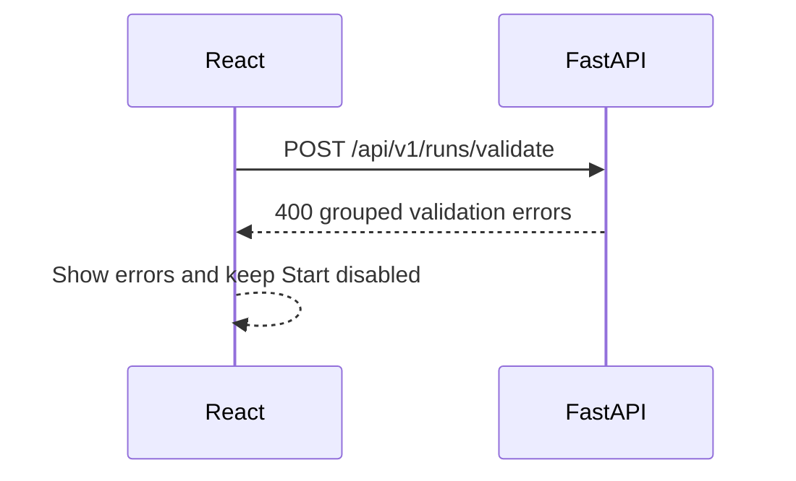
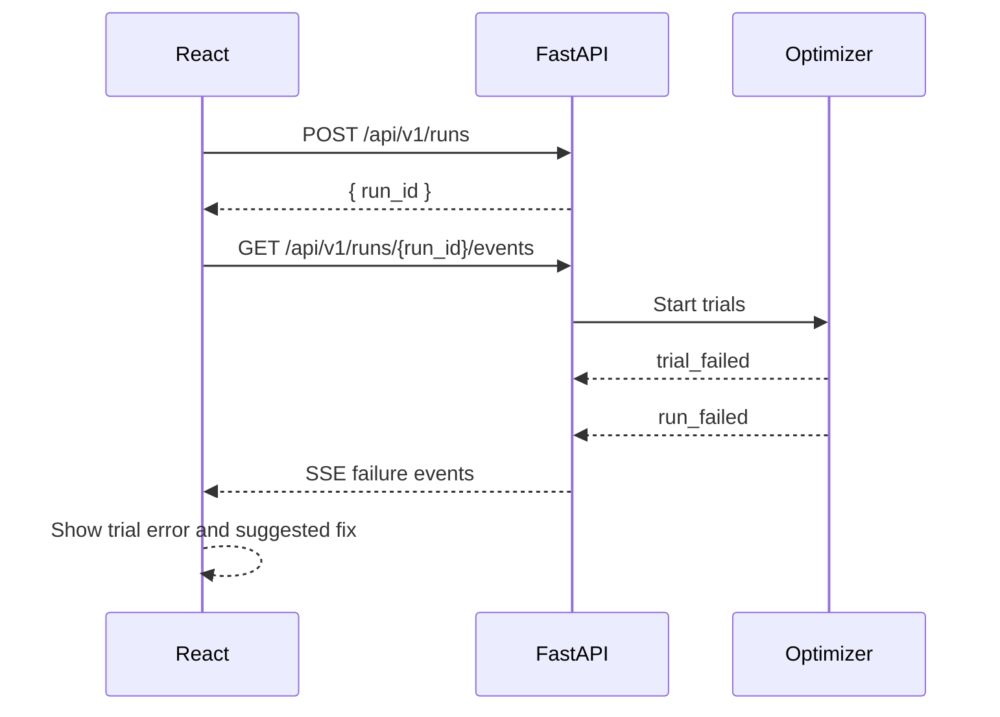

# Frontend Backend Link

The installed dashboard and API share the FastAPI service at port 8000. No Node
runtime is needed. During development, a separate React/Vite server proxies
relative `/api/v1/...` requests to FastAPI.

## Development Proxy

`frontend/vite.config.ts` contains:

```ts
server: {
  proxy: {
    "/api": "http://127.0.0.1:8000"
  }
}
```

This means the browser talks to Vite at `http://127.0.0.1:5173`, while API
requests are forwarded to `http://127.0.0.1:8000`.

When port 8000 is occupied, set `PSPSO_API_URL` before starting Vite, for
example `PSPSO_API_URL=http://127.0.0.1:8001 npm run dev`.

## Successful Run



## Validation Failure



## Training Failure After Start



## Endpoint Responsibilities

| Endpoint | Purpose |
| --- | --- |
| `GET /api/v1/estimators` | Frontend metadata for tasks, metrics, params, dependencies. |
| `POST /api/v1/runs/validate` | Validate the whole config before a run starts. |
| `POST /api/v1/runs` | Persist and queue a managed local worker run. |
| `POST /api/v1/runs/{run_id}/cancel` | Request cancellation of a queued or active local worker. |
| `POST /api/v1/runs/{run_id}/retry` | Create a new run from a saved run specification. |
| `POST /api/v1/experiments/{experiment_id}/tournament` | Queue comparable model runs under one experiment. |
| `GET /api/v1/runs/{run_id}/events` | Stream live progress over Server-Sent Events. |
| `GET /api/v1/runs/{run_id}` | Polling fallback and run snapshot. |
| `GET /api/v1/runs/{run_id}/result` | Final optimization result. |

FastAPI is not removed by the worker design. It remains the validation,
tracking, REST, and SSE backend. The browser never runs terminal commands:
the API process creates a controlled Python worker on the same machine.
