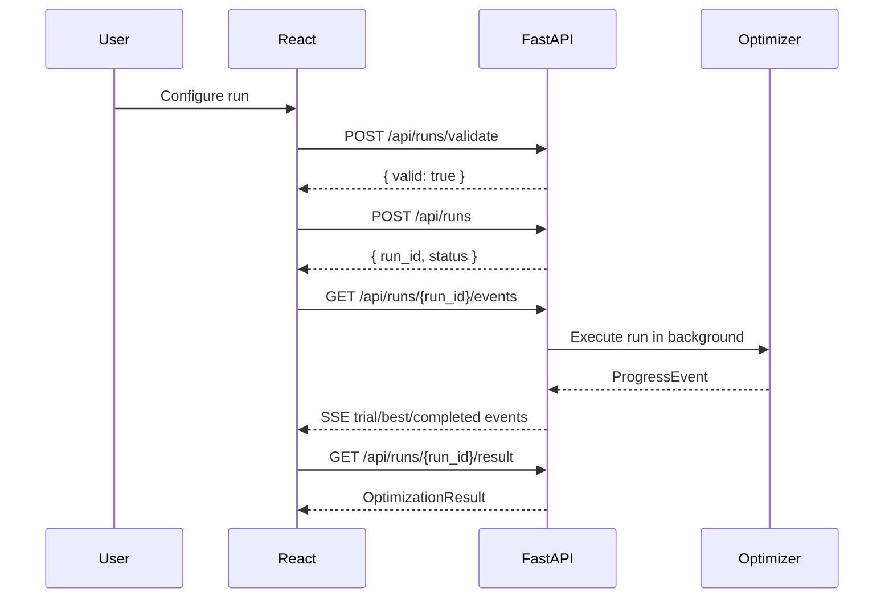
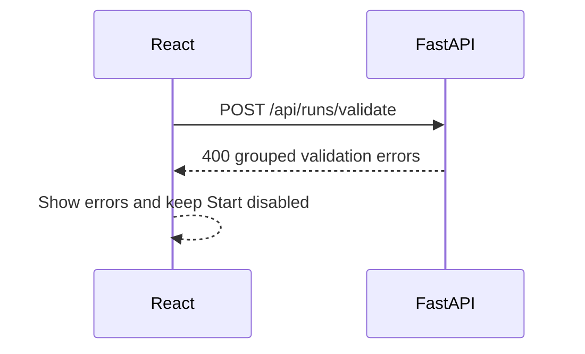
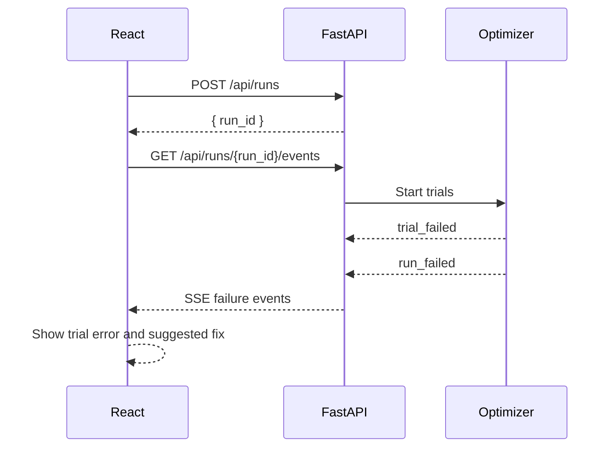

# Frontend Backend Link

The dashboard uses a separate React/Vite development server and FastAPI backend.
The frontend calls relative `/api/...` URLs; Vite proxies those calls to
FastAPI.

## Development Proxy

`frontend/vite.config.ts` contains:

```ts
server: {
  proxy: {
    "/api": "http://127.0.0.1:8000"
  }
}
```

This means the browser talks to Vite at `http://127.0.0.1:5173`, while API
requests are forwarded to `http://127.0.0.1:8000`.

## Successful Run



## Validation Failure



## Training Failure After Start



## Endpoint Responsibilities

| Endpoint | Purpose |
| --- | --- |
| `GET /api/estimators` | Frontend metadata for tasks, metrics, params, dependencies. |
| `POST /api/runs/validate` | Validate the whole config before a run starts. |
| `POST /api/runs` | Start a background optimization run. |
| `GET /api/runs/{run_id}/events` | Stream live progress over Server-Sent Events. |
| `GET /api/runs/{run_id}` | Polling fallback and run snapshot. |
| `GET /api/runs/{run_id}/result` | Final optimization result. |
