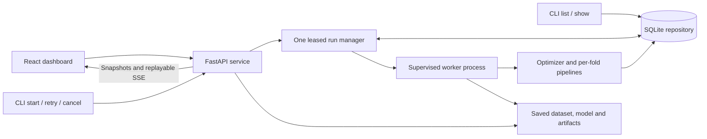
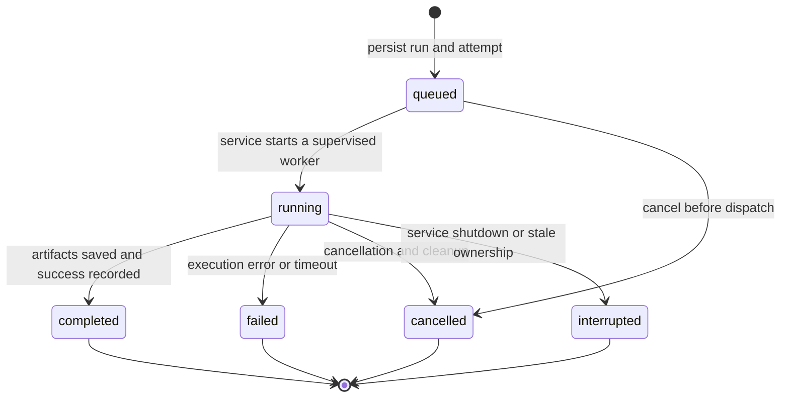
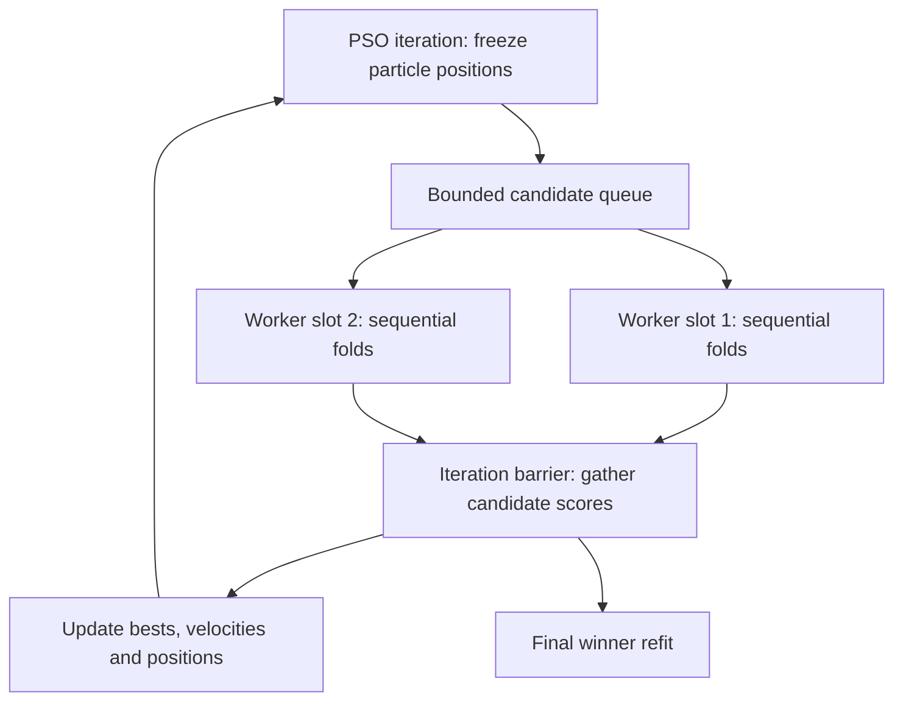
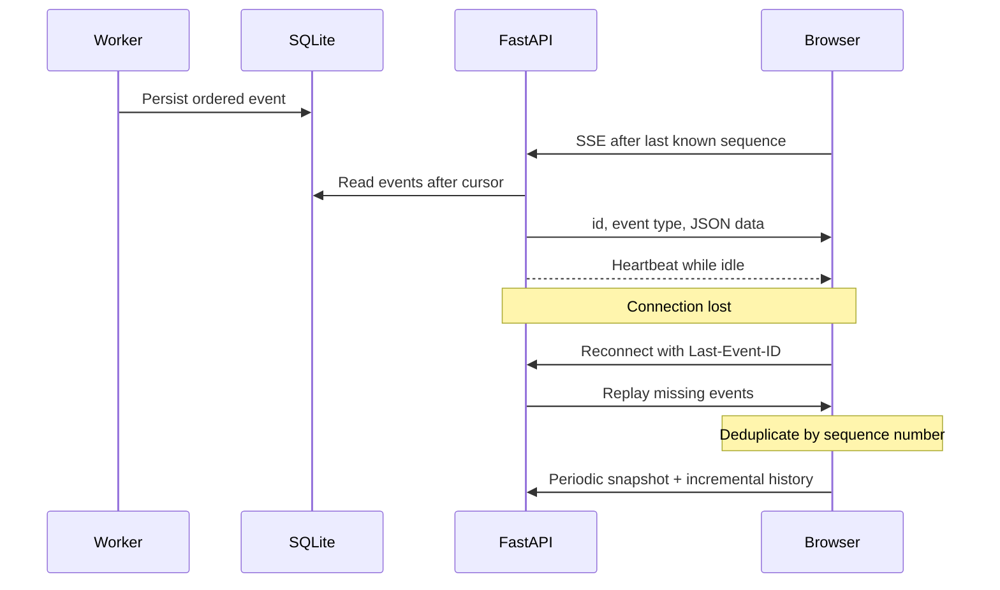
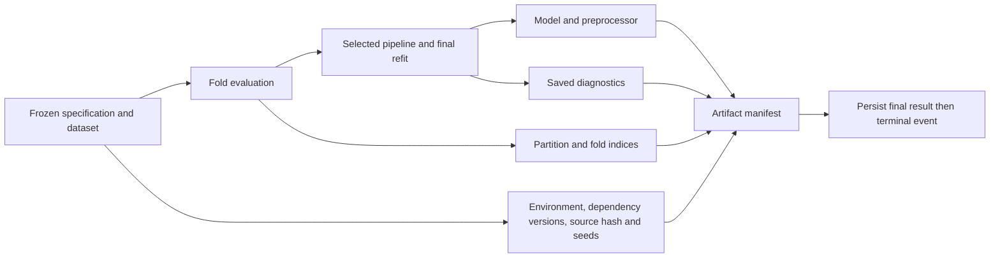

# Architecture

FastAPI's lifespan owns the sole run manager for its workspace. Creating an app
or reading a repository does not claim that ownership. Workers run outside the
HTTP process; the CLI routes managed start, cancel and retry operations through
the same `/api/v1` service used by React.

## Ownership, recovery and cancellation

An atomic SQLite transaction claims a service lease. The repository persists
service identity, PID, heartbeat, queued attempts, worker identity, termination
intent and parent run links. A second live service cannot claim the workspace.
The monitor renews its lease and stops if it loses ownership. One active run is
the default; `PSPSO_MAX_WORKERS` controls run-level concurrency.

Shutdown interrupts active attempts and leaves queued attempts for the next
service. Recovery reconciles completed records and marks stale active attempts
interrupted. Retry creates a new run and retains the original record.
Cancellation first persists intent; cooperative checks stop work between fits
and PyTorch epochs. After a bounded grace period, the supervisor terminates the
full process tree and waits for cleanup. Windows Job Objects also terminate
workers if their service process dies. Terminal updates are idempotent and late
progress events cannot resurrect a finished run.

## Candidate concurrency

`runtime.trial_workers` bounds candidate concurrency independently of run-level
concurrency. Grid and random search use bounded batches. Model-level `n_jobs` is
one when candidates run concurrently. Fit events identify candidate, fold,
iteration, actual worker slot and unique fit ID. Planned fits include final refit;
early stopping and failures can leave unused budget.

## Event delivery

The browser keeps its selected run ID in the route, so reloads reopen the same
run. Polling reconciles snapshots even while SSE is connected. Events are
persisted before delivery; worker output goes directly to a file and is also
tailed into structured log events.

## Artifact creation

Serialization failures emit visible warnings. Prediction and explanation
endpoints require saved inputs and models; they never fit replacements while
reading a result. Numbered, transactional migrations extend existing v1
workspaces without touching pre-1.0 data.
