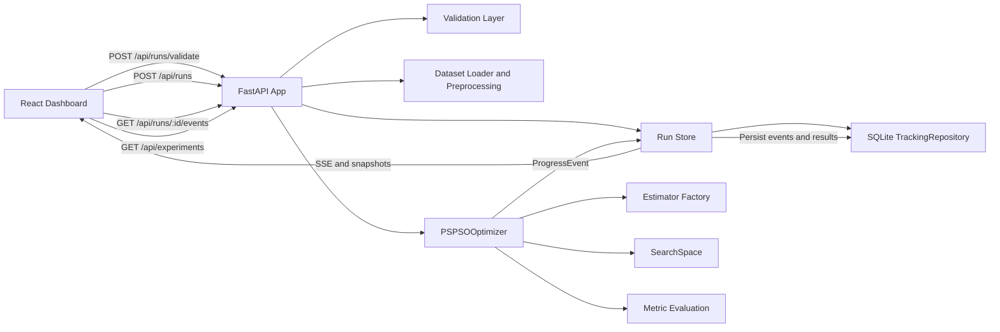

# Architecture

This page describes the current application components and how they work
together. The Excalidraw source for the diagram is available at:

- `docs/assets/pspso-architecture.excalidraw`

Open that file in Excalidraw to edit or export the diagram visually.

## Component Map

## Responsibilities

| Component | Responsibility |
| --- | --- |
| React dashboard | Collect user input, validate before run start, display live status, display history, export artifacts. |
| FastAPI app | Own request models, validation endpoints, run creation, history endpoints, and SSE stream endpoints. |
| Run store | Connect live in-memory run state with durable persisted tracking. |
| Tracking repository | Save experiments, runs, and ordered run events in SQLite. |
| Dataset layer | Load example data or CSV text, apply preprocessing, and split data. |
| Optimizer | Execute PSO, grid, or random search and emit progress events. |
| Estimator layer | Build sklearn, XGBoost, LightGBM, or legacy-compatible estimator presets. |

## Why The Design Looks Like This

The application is intentionally split between:

- a live path for responsive monitoring; and
- a persisted path for history and debugging.

If the backend only kept state in memory, a page refresh would lose the
timeline. If it only used persistence without a live store, the frontend would
feel slow and clumsy during active runs. The current structure keeps both
benefits.
