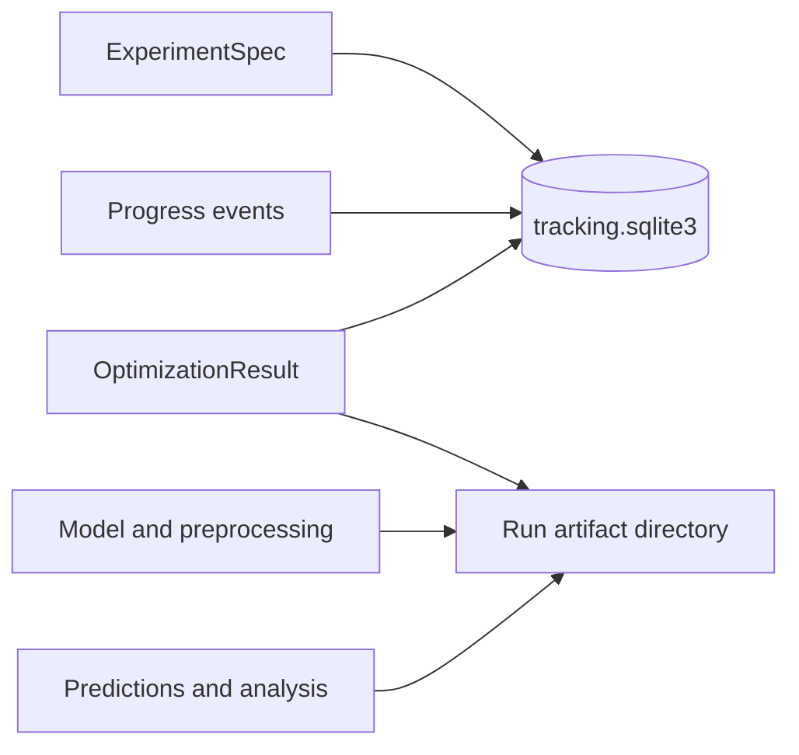

# Tracking and Artifacts

The default 1.0 workspace is `.pspso/v1/`. Set `PSPSO_HOME` to relocate the
workspace root; PSPSO then uses `$PSPSO_HOME/v1/`.

```text
.pspso/v1/
  tracking.sqlite3
  datasets/
  artifacts/runs/<run_id>/
    spec.json
    result.json
    analysis.json
    environment.json
    dataset.joblib
    split-indices.json
    worker.log
    selection-model.joblib
    model.joblib
    preprocessor.joblib
    manifest.json
```

SQLite stores experiments, runs, attempts, statuses, summaries, and ordered
events. Artifact files contain larger or reloadable outputs. A model or
preprocessor may be absent when its library does not support serialization; the
result and event record remain available.

Pre-1.0 files directly under `.pspso/` are not read or changed by 1.0.

Serialization failures emit `run_warning` events and create
`artifact-warnings.json`; Results displays the warnings. The environment records
dependency versions, Python/platform, actual device, source revision and digest,
dataset fingerprint and actual seeds. Holdout runs retain a selection model for
validation predictions before final refit. Downloads use saved data and models.

Service leases and attempts live in SQLite. Startup applies numbered,
non-destructive v1 migrations under a transaction. Repository reads never claim
service ownership or interrupt an active run.


